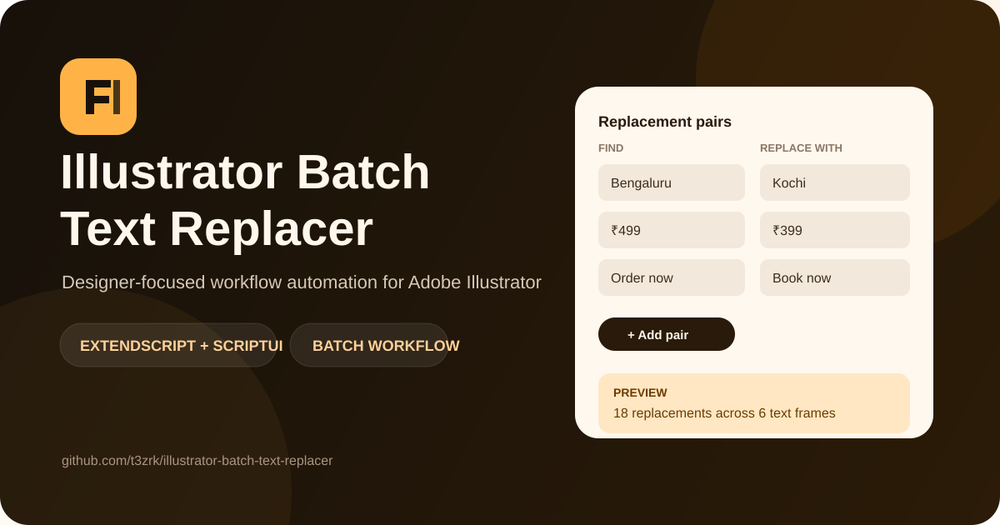

<p align="center">
  
</p>

# Illustrator Batch Text Replacer

A production-oriented Adobe Illustrator ExtendScript utility for replacing multiple words or phrases across several selected text frames in one pass.

Instead of editing repeated copy manually, the script lets a designer define a set of **Find → Replace** pairs, preview the number of changes, and apply them across selected text frames—including text nested inside selected groups.

## Why I built it

High-volume design production often includes repetitive copy updates: product names, prices, campaign labels, CTAs, locations, dates, language variants, and other repeated text. Illustrator does not provide a lightweight multi-pair replacement workflow for a selected set of frames, so this tool turns that repetitive task into a controlled batch operation.

## Features

- Multiple Find → Replace pairs in a single run
- Dynamic replacement rows, up to 12 pairs per batch
- Works across multiple selected Illustrator text frames
- Optional processing of text frames nested inside selected groups
- Case-sensitive or case-insensitive matching
- Whole-word / phrase-boundary matching
- Preview before committing changes
- Duplicate Find-value validation
- Exact replacement and changed-frame counts
- Blank replacement values for batch deletion
- Regex-safe handling of special characters in search text
- Original v1 script retained in `archive/` for project history

## Project structure

```text
illustrator-batch-text-replacer/
├─ src/
│  └─ IllustratorBatchTextReplacer.jsx
├─ docs/
│  ├─ hero.svg
│  └─ PORTFOLIO.md
├─ archive/
│  └─ Text Replace v1.jsx
├─ CHANGELOG.md
├─ CONTRIBUTING.md
├─ LICENSE
└─ README.md
```

## Installation and usage

1. Download `src/IllustratorBatchTextReplacer.jsx`.
2. Open Adobe Illustrator and the document you want to edit.
3. Select one or more text frames, or select groups that contain text frames.
4. In Illustrator, use **File → Scripts → Other Script…** and choose the `.jsx` file.
5. Add your Find and Replace pairs.
6. Choose matching options.
7. Use **Preview** to verify the expected number of replacements.
8. Click **Replace All** and confirm.

For frequent use, you can place the script in Illustrator's Scripts directory for your installed version and restart Illustrator so it appears in the Scripts menu.

## Example workflow

| Find | Replace with |
| --- | --- |
| `Bengaluru` | `Kochi` |
| `₹499` | `₹399` |
| `Order now` | `Book now` |

Run the script on the selected campaign frames, preview the count, and apply all three changes in one operation.

## Technical notes

The utility is written in **Adobe ExtendScript / JavaScript** and uses **ScriptUI** for the interface. Search values are escaped before being used in regular expressions, which prevents characters such as `+`, `(`, `)`, `.`, `?`, or `[` from unintentionally changing the search pattern.

Replacements are processed from top to bottom. This means a replacement created by an earlier pair can be matched by a later pair. That order is intentional and should be considered when creating replacement sets.

> **Formatting note:** the script updates a text frame's contents. If a single text frame contains highly complex mixed character styling, test the operation on a copy first and use Illustrator Undo if needed.

## Product evolution

### v1

The original utility used five fixed replacement rows and worked only on directly selected text frames.

### v2

The current version adds a more resilient UI, dynamic rows, grouped-text discovery, preview mode, validation, accurate replacement counts, and clearer user feedback.

See [CHANGELOG.md](CHANGELOG.md) for details.

## Portfolio positioning

This project demonstrates:

- Design-production automation
- Adobe Illustrator scripting
- Workflow analysis and tool building
- ScriptUI interface design
- Regex-safe text processing
- AI-assisted development and iterative refinement

A ready-to-use case-study summary is included in [`docs/PORTFOLIO.md`](docs/PORTFOLIO.md).

## Author

Built by [@t3zrk](https://github.com/t3zrk) as a designer-focused workflow automation project.

## License

MIT License. See [LICENSE](LICENSE).
